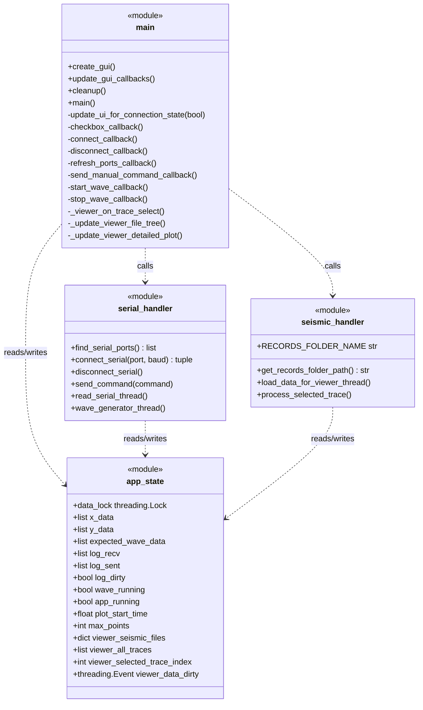

  
# Mesa Sísmica de Bajo Costo con Control y GUI

Sistema de **reproducción de acelerogramas reales** en una mesa sísmica de laboratorio. Convierte registros aceleración–tiempo en trayectorias de **posición** y las ejecuta en tiempo real mediante un **ESP32** y **realimentación** con encoder magnético **AS5600**.

## 🧱 Diagrama flujo

```mermaid
graph TD
    subgraph PC["App"]
        A[Acelerograma a-t] --> B[Filtro/Normalización]
        B --> C[Integración Doble ∫∫]
        C --> D[Desplazamiento Deseado x_ref]
        D --> CMD[Generación de Comandos STEP/DIR]
        F[Monitor/Visualización]
        POS[Posición Real x_actual] --> F
        D --> F
    end
    
    CMD -->|Serial/USB| G
    
    subgraph Mesa["Mesa Sísmica"]
        G[ESP32 Controlador]
        K[Encoder AS5600]
        GEN[Generador Pulsos STEP/DIR]
        H[Driver Motor Stepper]
        I[Motor Paso a Paso]
        J[Actuador/Mesa]
       
        G -->|Comandos| GEN
        GEN -->|STEP + DIR| H
        H -->|Corriente| I
        I -->|Movimiento| J
        J -->|Rotación Eje| K
        K -->|I2C SDA/SCL GPIO21/22| G
        G -->|Feedback Serial| POS
    end
```

## 🧱 Diagrama de Clases 

## 🧱 Diagrama de casos de uso 

```mermaid
graph LR
    User([👤 Usuario/Operador])
    ESP32([🔌 ESP32 + Encoder AS5600])
    
    subgraph System["Sistema Mesa Sísmica"]
        UC1((Conectar<br/>a ESP32))
        UC2((Desconectar<br/>ESP32))
        UC3((Enviar<br/>Comando Manual))
        UC4((Configurar<br/>Parámetros Motor))
        UC5((Generar<br/>Onda Sinusoidal))
        UC6((Detener<br/>Generación))
        UC7((Cargar<br/>Registros Sísmicos))
        UC8((Seleccionar<br/>Traza Sísmica))
        UC9((Visualizar<br/>Traza Detallada))
        UC10((Procesar<br/>Traza para Mesa))
        UC11((Monitorear<br/>Posición Real))
        UC12((Comparar<br/>Expected vs Real))
    end
    
    User --- UC1
    User --- UC2
    User --- UC3
    User --- UC4
    User --- UC5
    User --- UC6
    User --- UC7
    User --- UC8
    User --- UC9
    User --- UC10
    User --- UC11
    User --- UC12
    
    UC1 -.- ESP32
    UC2 -.- ESP32
    UC3 -.- ESP32
    UC5 -.- ESP32
    UC6 -.- ESP32
    UC11 -.- ESP32
    UC12 -.- ESP32
    
    UC5 -.->|include| UC4
    UC10 -.->|include| UC8
    UC9 -.->|include| UC8
    UC11 -.->|require| UC1
    UC3 -.->|require| UC1
    UC5 -.->|require| UC1
    
```

## 🗺️ Roadmap

* Migración a **servomotor** + **PID avanzado** (o control en espacio de estados).
* Mejoras de **filtrado** para reducir deriva post integración.
* **Auto–calibración** de encoder / homing robusto.
* Soporte para **múltiples ejes** y perfiles 6-DoF (futuro).
* Exportación de **reportes** (PDF/CSV) con métricas de seguimiento.

[## 📚 Citar / Referencias]: # 

## 🤝 Contribuciones

¡PRs bienvenidos! Abre un **issue** con: descripción, logs, versión de firmware/GUI, esquema de conexiones y archivos de prueba mínimos.

## 📄 Licencia

Indica aquí tu licencia (p. ej., MIT, Apache-2.0 o CC BY-NC-SA).
`SPDX-License-Identifier: MIT`

## 📨 Contacto

* Autor/es: Juan Sebastian Hernandez
* Lab/Universidad: Universidad Cooperativa de Colombia
