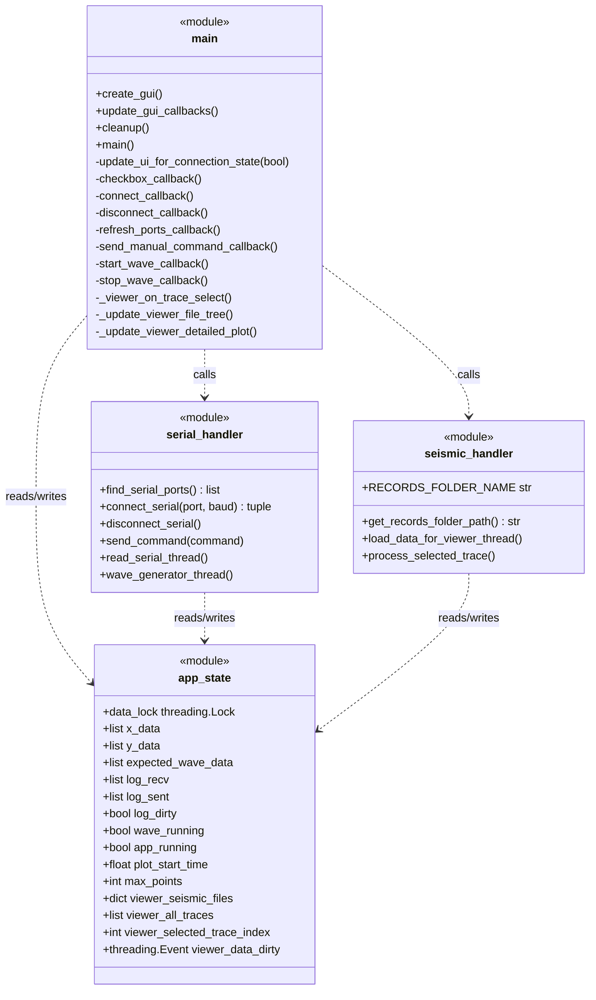

  
# Mesa Sísmica de Bajo Costo con Control y GUI

Sistema de **reproducción de acelerogramas reales** en una mesa sísmica de laboratorio. Convierte registros aceleración–tiempo en trayectorias de **posición** y las ejecuta en tiempo real mediante un **ESP32**, un **driver microstepping** y **realimentación** con encoder magnético **AS5600**. Incluye **interfaz gráfica** para cargar señales, monitorear la respuesta y operar la mesa.

## ✨ Características

* 📥 **Importación de registros sísmicos** (formato CSV/ASCII) y preprocesamiento.
* 🔁 **Transformación** a posición (filtrado + doble integración + escalado mecánico).
* 🧠 **Control**: abierto (rampas/ondas) y lazo cerrado preliminar con PID.
* 🧰 **GUI** para carga de señales, control de ejecución, gráficos en tiempo real.
* 🔌 **Hardware económico** y replicable (ESP32 + driver + motor + encoder).

## 🧱 Diagrama flujo

```mermaid
graph TD
    subgraph PC["App"]
        A[Acelerograma a-t] --> B[Filtro/Normalización]
        B --> C[Integración Doble ∫∫]
        C --> D[Desplazamiento Deseado x_ref]
        D --> CMD[Generación de Comandos STEP/DIR]
        F[Monitor/Visualización]
        POS[Posición Real x_actual] --> F
        D --> F
    end
    
    CMD -->|Serial/USB| G
    
    subgraph Mesa["Mesa Sísmica"]
        G[ESP32 Controlador]
        K[Encoder AS5600]
        GEN[Generador Pulsos STEP/DIR]
        H[Driver Motor Stepper]
        I[Motor Paso a Paso]
        J[Actuador/Mesa]
       
        G -->|Comandos| GEN
        GEN -->|STEP + DIR| H
        H -->|Corriente| I
        I -->|Movimiento| J
        J -->|Rotación Eje| K
        K -->|I2C SDA/SCL GPIO21/22| G
        G -->|Feedback Serial| POS
    end
```


## 🧱 Diagrama de Clases 

## 🧱 Diagrama de casos de uso 

## 🛒 Bill of Materials (BoM)

* Control: **ESP32** DevKit (WROOM o S3).
* Driver de motor: **DM542T** (recomendado) o equivalente microstepping robusto.
* Motor: **NEMA 23/24** (según carga y carrera).
* Sensor: **AS5600** (encoder magnético) + imán diametral.
* Fuente DC: **24–48 V**, corriente según motor (≥ 4–6 A típico).
* Mecánica: rieles lineales, husillo/correa, mesa/plataforma, topes y guarda.

> ⚠️ Ajusta la selección según masa máxima en la mesa, carrera útil y aceleraciones objetivo.


## 🔧 Conexiones (referencia)

| Señal             | ESP32 Pin  | Driver/AS5600  | Nota                    |
| ----------------- | ---------- | -------------- | ----------------------- |
| STEP              | GPIO **X** | DM542T STEP+/- | Ajustar a tu placa      |
| DIR               | GPIO **Y** | DM542T DIR+/-  | Sentido de giro         |
| ENABLE (opcional) | GPIO **Z** | DM542T ENA+/-  | Activa/desactiva driver |
| AS5600 SDA        | GPIO 21    | SDA            | I²C                     |
| AS5600 SCL        | GPIO 22    | SCL            | I²C                     |
| 5V / 3V3          | 3V3/5V     | AS5600 VCC     | Según módulo            |
| GND               | GND        | Todos          | Masa común              |

> Define los pines reales en `firmware/config.h`.

## 🚀 Puesta en Marcha

### 1) Firmware (ESP32)

1. Instala **Arduino IDE** o **ESP-IDF** con toolchain para ESP32.
2. Abre `firmware/` y configura `config.h`:

   * Pasos por vuelta, **microstep**, relación mecánica (mm/paso o deg/paso).
   * Pines STEP/DIR/ENABLE, límites de viaje, **KP/KI/KD** iniciales.
3. Compila y sube al ESP32.

### 2) GUI (Python)

```bash
cd gui
python -m venv .venv
. .venv/bin/activate   # (Windows: .venv\Scripts\activate)
pip install -r requirements.txt
python app.py
```

* Selecciona el **puerto serial** del ESP32.
* Carga un acelerograma (`data/samples/…`), ajusta **filtro** y **escala**.
* Genera la **trayectoria** y ejecuta.
* Observa **referencia vs. respuesta** en tiempo real.

## ⚙️ Configuración de Señales

* **Entrada**: aceleración (m/s² o g) con paso de muestreo conocido.
* **Preprocesado**: detrending/HPF para remover deriva, normalización a la capacidad del actuador.
* **Doble integración**: a → v → x (con filtros para minimizar deriva).
* **Escalado**: convierte x(t) a **pasos** mediante (mm por vuelta / microstep).

## 📊 Pruebas y Validación

* **Ondas de prueba**: seno, rampa, chirp para validar carrera/velocidad.
* **Seguimiento**: error RMS y pico, pérdida de paso (0 si correcto).
* **Temperatura**: monitoreo térmico del driver y motor en cargas prolongadas.
* **Carga**: ensayos con masa representativa y fijaciones seguras.

## 🛡️ Seguridad

* Botón de **emergencia** (corte de potencia del driver).
* **Límites** de software y topes mecánicos.
* Nunca operar sin **guardas** y anclaje del cuerpo de prueba.

## 🧪 Resultados (resumen)

* Conversión estable de acelerogramas → trayectorias de posición.
* GUI operable para **carga, ejecución y visualización**.
* Control en **lazo cerrado** preliminar con **AS5600** y sintonía inicial PID.
* Operación sin pérdida de pasos en perfiles dentro de los límites mecánicos.

## 🗺️ Roadmap

* Migración a **servomotor** + **PID avanzado** (o control en espacio de estados).
* Mejoras de **filtrado** para reducir deriva post integración.
* **Auto–calibración** de encoder / homing robusto.
* Soporte para **múltiples ejes** y perfiles 6-DoF (futuro).
* Exportación de **reportes** (PDF/CSV) con métricas de seguimiento.

## 📚 Citar / Referencias


## 🤝 Contribuciones

¡PRs bienvenidos! Abre un **issue** con: descripción, logs, versión de firmware/GUI, esquema de conexiones y archivos de prueba mínimos.

## 📄 Licencia

Indica aquí tu licencia (p. ej., MIT, Apache-2.0 o CC BY-NC-SA).
`SPDX-License-Identifier: MIT`

## 📨 Contacto

* Autor/es: Juan Sebastian Hernandez
* Lab/Universidad: Universidad Cooperativa de Colombia
